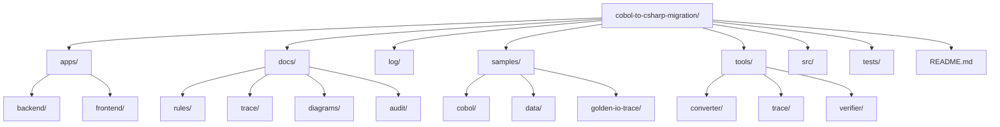

# Repository Structure

## Overview

This document describes the top-level directory structure of the repository and highlights key areas used in the COBOL-to-C# migration workflow.

**README presence:** `README.md` exists at the repository root.

## Top-Level Structure (Tree)

```text
cobol-to-csharp-migration/
├── .github/
├── apps/
│   ├── backend/
│   └── frontend/
├── bin/
├── docs/
│   ├── audit/
│   ├── decisions/
│   ├── diagrams/
│   ├── prompts/
│   ├── rules/
│   ├── samples/
│   ├── spec/
│   ├── trace/
│   └── verification/
├── log/
├── obj/
├── samples/
│   ├── cobol/
│   ├── data/
│   ├── golden-io-trace/
│   └── mvp01/
├── src/
├── temp/
├── tests/
├── tools/
│   ├── converter/
│   ├── trace/
│   └── verifier/
├── .gitattributes
├── .gitignore
├── CobolToCsharpMigration.sln
├── PROJECT_STATUS.md
├── PROJECT_STATUS_JP.md
└── README.md
```

## Structure Diagram (Mermaid)



## Notes

- `apps/backend/` contains runtime and tests used for MVP implementation and verification.
- `docs/rules/` and `docs/trace/` hold transformation rules and trace specifications.
- `samples/golden-io-trace/` is the Phase2 golden case for cross-runtime trace comparison.
- `tools/trace/` contains trace comparison scripts and related test data.

## Additional README Files (Non-root)

The repository also contains README-style documents outside the root `README.md` that describe directory goals and operation rules:

- `docs/prompts/README.md`
  - Defines the prompt governance model for AI-driven development phases (`dev`, `audit`, `editor`, `refactor`).
- `docs/prompts/exec/README.md`
  - Defines how execution prompts are stored as reproducible work records and naming conventions.
- `tools/trace/README.md`
  - Explains Phase2 trace comparison flow, golden test data usage, and expected command outcomes.
- `.vscode/README-ai-usage.md`
  - Documents VS Code AI operation rules, role split, and usage policy across multiple assistants.
